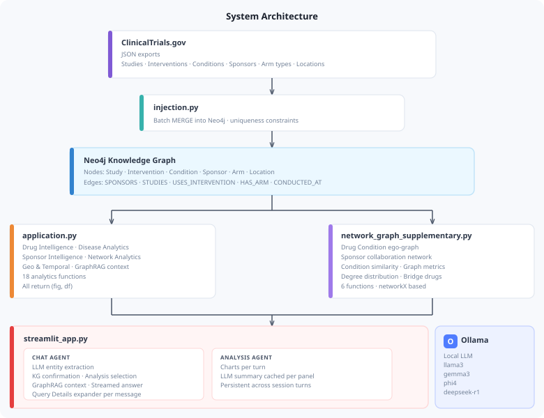

# TrialGraph - Clinical trial intelligence

TrialGraph transforms raw ClinicalTrials.gov data into a queryable property graph on Neo4j, then exposes it through five analytical modules and a fully local GraphRAG agent.

It is an **LLM orchestrated analytical pipeline with GraphRAG**. The LLM performs entity extraction and analysis selection, all tool execution is deterministic python codes.

**What makes it agentic adjacent:**
- Two focused LLM calls per query with structured outputs
- Conversation context persists across turns
- Dynamic analysis selection based on question semantics
- KG grounded answers with no hallucinated statistics

Ask it things like:

- *"What drugs is Amgen testing and what are the trial details?"*
- *"How does the Alzheimer's pipeline funnel compare to Diabetes?"*
- *"Which drugs act as structural bridges across disease communities?"*
- *"What are Pfizer's top therapeutic areas and phase completion rates?"*
- *"Can you explain what happens in NCT02103283?"*

---

## Table of Contents

1. [Architecture](#architecture)
2. [Graph Schema](#graph-schema)
3. [Analytical Modules](#analytical-modules)
4. [Query Pipeline — How the Agent Works](#query-pipeline--how-the-agent-works)
5. [Streamlit Application](#streamlit-application)

---

## Architecture

### Two Stage LLM Pipeline

Every query runs two focused Ollama calls before the main answer:

1. **`llm_extract_entity()`** : identifies the named entity (drug, disease, sponsor) from the question using natural language understanding.
2. **`llm_select_analyses()`** : given the resolved entity and question, selects which of 18 catalogued analyses to run. Uses a closed vocabulary so hallucinated analysis types are impossible.

Both calls use `temperature=0` for determinism and complete in under one second on typical hardware.

---

## Graph Schema

### Node Labels

| Label | Key Properties |
|---|---|
| `Study` | `nct_id`, `phases`, `overall_status`, `enrollment`, `start_date`, `completion_date`, `study_type`, `allocation`, `masking` |
| `Intervention` | `name`, `type` |
| `Condition` | `name` |
| `Sponsor` | `name`, `class`  |
| `Arm` | `type` |
| `Location` | `country`, `city` |

### Relationships

| Relationship | Direction | Meaning |
|---|---|---|
| `SPONSORS` | Sponsor → Study | Sponsor funds/leads the trial |
| `STUDIES` | Study → Condition | Trial targets a disease or condition |
| `USES_INTERVENTION` | Study → Intervention | Trial tests a drug or device |
| `HAS_ARM` | Study → Arm | Trial contains this arm |
| `CONDUCTED_AT` | Study → Location | Trial runs at this facility |

---

## Analytical Modules

All functions in `application.py` and `network_graph_supplementary.py` return `(fig, df)`.

### Module 1: Drug Intelligence

| Function | What It Returns |
|---|---|
| `drug_evidence` | Phase distribution, statuses, enrollment, conditions, sponsors |
| `drug_competition` | All drugs sharing a condition, ranked by trial count |
| `drug_geo` | Countries running trials for the drug |
| `drug_paths` | Multi hop Drug→Trial→Condition→Sponsor paths, used for GraphRAG context |

**Example — Semaglutide:** Phase 3 dominant, US centric geography, Novo Nordisk as lead sponsor, Diabetes Mellitus Type 2 and Obesity as primary conditions.

### Module 2: Disease Analytics 

| Function | What It Returns |
|---|---|
| `disease_landscape` | All active drugs ranked by trial volume |
| `disease_phase_progression` | Phase distribution funnel |
| `disease_enrollment` | Enrollment histogram + median by phase |
| `disease_design` | Allocation, blinding, arm type breakdown |
| `disease_sponsor_diversity` | Industry vs Academic vs Government sponsor split |

**Example — Diabetes:** Mature, RCT dominated landscape. Over 85% of trials randomised. Phase 3 median enrollment exceeds 300. Industry led by Novo Nordisk and Eli Lilly.

**Example — Alzheimer's:** Inverted funnel peaking at Phase 2. High academic and government sponsorship. Large Phase 3 enrollment requirements signal high cost and risk.

### Module 3: Sponsor Intelligence

| Function | What It Returns |
|---|---|
| `sponsor_portfolio` | Condition areas ranked by trial count |
| `sponsor_drugs` | All interventions the sponsor is testing |
| `sponsor_pipeline` | Phase × Status cross-tabulation |
| `sponsor_geo` | Countries where the sponsor runs trials |
| `sponsor_collaborators` | Co-sponsors from shared trials |

**Example — Pfizer:** 15+ therapeutic areas, Phase 2/3 completion heavy pipeline, US and UK as leading geographies.

**Example — Novo Nordisk:** Tightly focused on Diabetes and Obesity, Semaglutide and insulin analogues as flagship compounds, Germany leading geographic reach.

### Module 4: Network & Graph Analytics

| Function | Algorithm | What It Shows |
|---|---|---|
| `centrality` | Degree + Betweenness | Most connected / most bridge like nodes |
| `community_detection` | Louvain | Dense therapeutic clusters without expert labels |
| `drug_repurposing` | Condition breadth | Drugs studied across the most distinct conditions |
| `drug_condition_subgraph` | Ego-graph | Drug–Condition–Sponsor neighbourhood |
| `sponsor_network` | Co-occurrence | Weighted sponsor collaboration graph |
| `condition_similarity_network` | Shared drugs | Conditions linked by common treatments |
| `graph_metrics` | Summary stats | Nodes, edges, density, components |
| `degree_distribution` | Log-scale | Degree distribution plots (log and log-log) |
| `bridge_drugs` | Betweenness | Drugs acting as structural bridges |

**Centrality highlights:**
- **Obesity**  highest degree node; GLP-1, SGLT2, bariatric, and behavioural trials all converge here
- **Dexamethasone**  sole pharmaceutical in the betweenness top 25; bridges oncology, COVID19, surgery, sepsis, and haematology simultaneously

**Community detection:** 15,585 communities detected; 28 mega clusters (>1,000 nodes) align precisely with biomedical domains, Metabolic & Behavioural Health, Oncology, Cardiovascular, Infectious Disease, Hepatitis B Virology with no expert labelling.

**Repurposing archetypes:**
- Cytotoxic backbone drugs (broad oncology use via DNA damage and immune modulation)
- Checkpoint inhibitors (tumour agnostic expansion; Nivolumab appearing in HBV and COVID19)
- Corticosteroids (Dexamethasone as the canonical cross-disease repurposing success)

### Module 5: Geo & Temporal Analytics 

| Function | What It Shows |
|---|---|
| `trial_density` | Trial counts by country globally |
| `trial_timeline` | Monthly trial start activity over time |
| `geo_phase_heatmap` | Country × Phase heatmap |

---

## Query Pipeline — How the Agent Works

### Resolution Methods

| Code | Meaning |
|---|---|
| `nct_id` | NCT ID matched by regex, trial queried directly |
| `llm_kg` | LLM extracted entity, confirmed in knowledge graph |
| `llm_only` | LLM extracted entity, not found in KG |
| `conversation_context` | Inherited from prior turn |

## Streamlit Application

