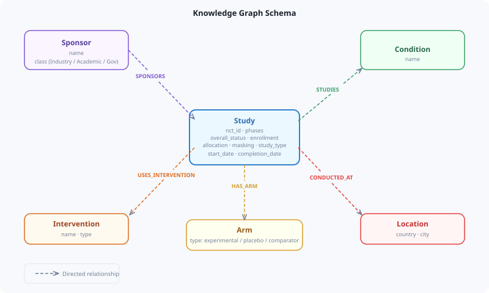
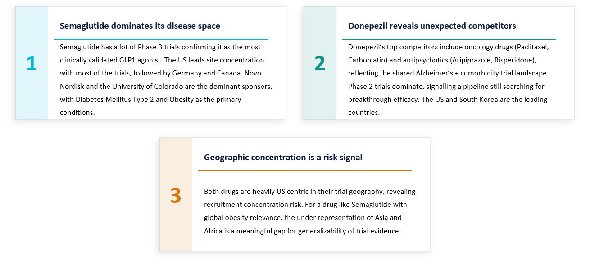
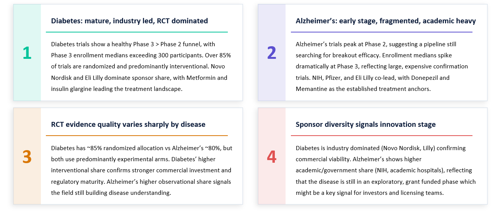
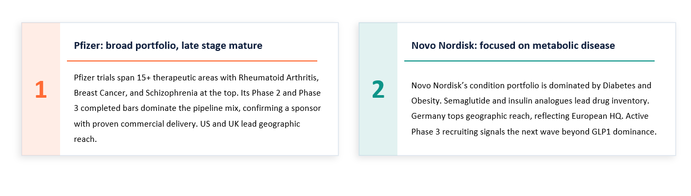
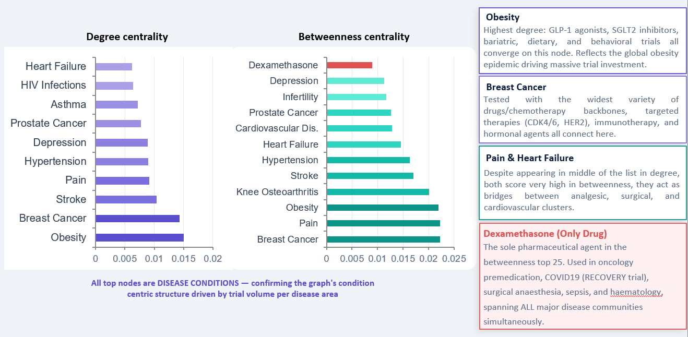
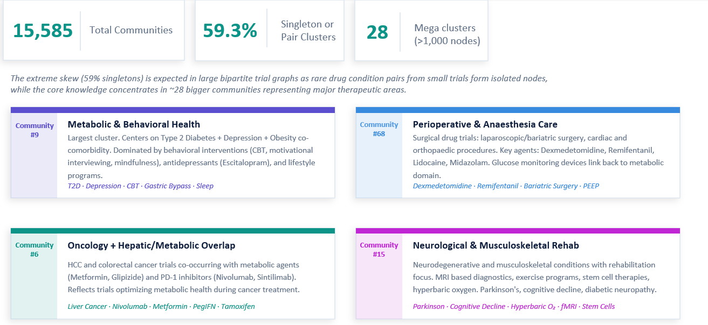
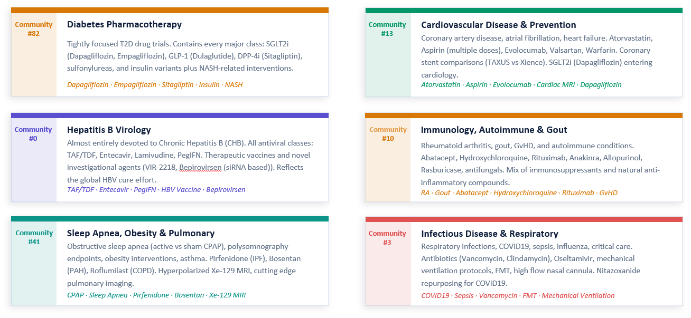
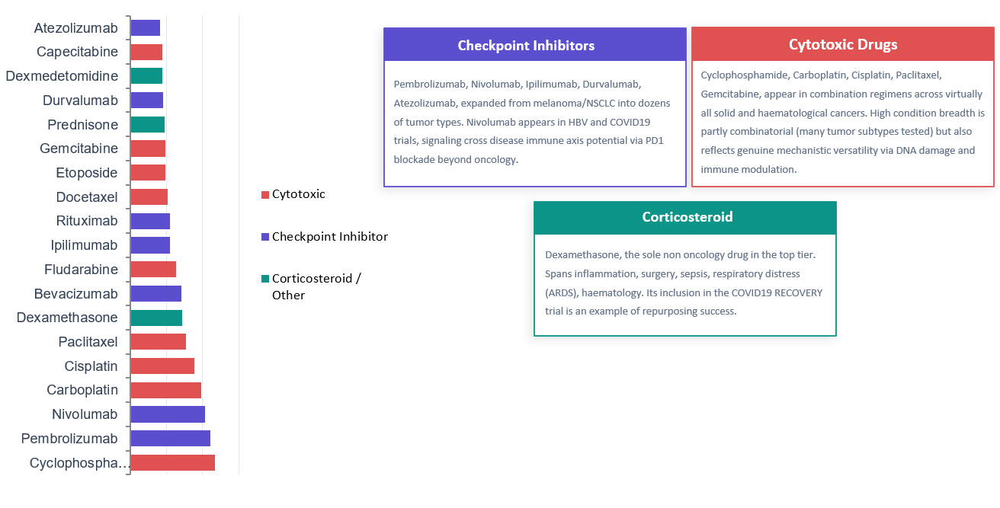
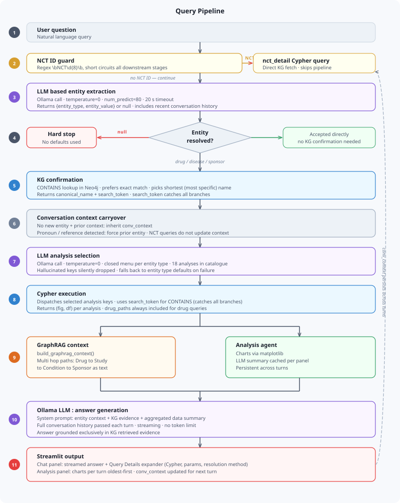
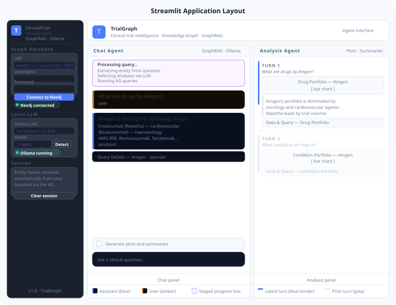

# TrialGraph: Clinical Trails Knowledge Graph with LLM orchestrated analytical pipeline

**TrialGraph** transforms raw `ClinicalTrials.gov` data into a queryable property graph on Neo4j, then exposes it through five analytical modules and a GraphRAG agent.

ClinicalTrials.gov contains over 400,000 registered studies. It is one of the most comprehensive drug development datasets in existence, and querying it for anything beyond a single trial requires either writing painful multi join SQL.

```
The questions that actually matter are not single row lookups. They are graph questions, multi-hop traversals across drugs, diseases, sponsors, and trial networks. TrialGraph is a platform that treats clinical trial data exactly that way: as a property graph on Neo4j, queried through Cypher, with a two stage LLM pipeline routing natural language questions to the right analyses and assembling grounded answers from the graph.
```


## Why a Graph, Not a Relational Database

ClinicalTrials.gov data looks relational at first glance, studies have sponsors, interventions, conditions, arms, and locations. The temptation is to throw it in Postgres and write some dashboards. But the interesting questions are graph questions by nature.

*"What drugs compete with Semaglutide?"* requires traversing from the Semaglutide intervention node to every condition it treats, then back out through every other drug studied in those same conditions, counting and ranking. In SQL that is three joins, a GROUP BY, and a self join on the studies table that grows quadratically with trial volume. In Cypher it is a single MATCH clause that walks the bipartite graph in one pass:

```cypher
MATCH (i:Intervention)<-[:USES_INTERVENTION]-(st:Study)-[:STUDIES]->(c:Condition)
      <-[:STUDIES]-(st2:Study)-[:USES_INTERVENTION]->(i2:Intervention)
WHERE toLower(i.name) CONTAINS toLower($drug)
  AND toLower(i2.name) <> toLower($drug)
RETURN i2.name AS competitor, COUNT(DISTINCT st2) AS trials
ORDER BY trials DESC
```

*"Which drugs are structural bridges between disease clusters?"* requires betweenness centrality (a metric computed over the topology of the network) on the full graph, not its attribute values, and one that has no SQL equivalent. *"Which conditions are clinically adjacent through shared treatments?"* is a weighted similarity graph where edge weights are shared drug counts. These are native graph operations. Forcing them into a relational model means materialising intermediate result sets that are both expensive to compute and awkward to extend.

The schema has six node labels: Study, Intervention, Condition, Sponsor, Arm, Location and five directed relationship types: SPONSORS, STUDIES, USES_INTERVENTION, HAS_ARM, CONDUCTED_AT. The graph is loaded from ClinicalTrail JSON exports using MERGE statements on NCT IDs and node names, with uniqueness constraints on each label set before any data is loaded. This makes ingestion idempotent: re-running against updated exports is safe and fast because Neo4j resolves MERGE operations through the constraint index rather than scanning.



## Five Analytical Modules

Every function in `application.py` follows the same interface: a `KGClient` instance and one entity parameter in, a `(fig, df)` tuple out. Every function is directly compatible with `st.pyplot()` in Streamlit without wrapper code. There are 18 named analyses across five modules, each corresponding to a specific Cypher traversal pattern.

### Drug Intelligence

Four queries characterise any compound in the graph. The evidence profile aggregates phase distribution, overall statuses, enrollment sizes, targeted conditions, and sponsor names, assembled in a single multi hop traversal rather than separate queries. The competitive landscape traversal walks Drug→Condition←Drug to find every compound sharing any condition with the target, ranked by trial count. The geographic footprint query aggregates trial counts by Location.country. The multi hop path query, Intervention→Study→Condition, Study→Sponsor, produces the structured subgraph that feeds the GraphRAG context at query time.

Semaglutide was used reference. The graph shows what the evidence base looks like: Phase 3 dominance, heavy US geographic concentration, Novo Nordisk as the lead sponsor by a wide margin, Diabetes Mellitus Type 2 and Obesity as primary indications. The competitive landscape query returns not just other GLP-1 agonists (Liraglutide, Dulaglutide, Tirzepatide) but SGLT2 inhibitors, DPP-4 inhibitors, bariatric surgery trials, and behavioural interventions,the full metabolic disease competitive space, resolved in one traversal.



### Disease Analytics

Five queries characterise the clinical development landscape of a disease area. The phase funnel is the most diagnostically informative. A healthy pipeline shows I >> II >> III, attrition at each stage is expected as the evidence bar rises. Alzheimer's shows an inverted funnel peaking at Phase II. It reflects the biological reality of the disease: heterogeneous cooccurrence of amyloid plaque deposition, tau hyperphosphorylation, and neuroinflammation across patients produces variable trial populations, diffuse endpoints, and effect sizes too small to survive Phase III statistical thresholds consistently.

The enrollment analysis complements the funnel. Diabetes Phase 3 trials run with median enrollment above 300 participants over periods of months. Alzheimer's Phase 3 trials regularly require 1,000 to 2,000 participants with multi year follow up, because the statistical power required to detect modest effects on heterogeneous outcomes at that scale is correspondingly high.



### Sponsor Intelligence

Profiling a sponsor against the full graph reveals strategic posture that no internal pipeline dashboard captures. Novo Nordisk's condition portfolio is highly concentrated: Diabetes and Obesity account for the overwhelming majority of trial volume, with Semaglutide and insulin analogues (Detemir, Degludec, Aspart) as the dominant compounds. Phase composition is late stage heavy, consistent with a company in the validation and launch phase of a focused portfolio rather than broad early stage exploration. Pfizer's portfolio spans 15+ therapeutic areas: a diversified strategy visible directly from graph queries without reading a single press release.

The collaborator network query i.e., sponsors co-appearing in the same trials, surfaces active partnership structures that are not disclosed in any other structured form. Academic medical centers running trials with industry sponsors, biotech companies appearing as co-sponsors alongside major pharmaceutical firms, government funding agencies co-sponsoring alongside industry: all of these relationships exist in the trial registrations.



### Network and Graph Analytics

This module produces findings that have no relational equivalent.

`Betweenness centrality` on the drug–condition bipartite graph identifies nodes whose removal would most increase the average shortest path length between other nodes. The top 25 by betweenness is dominated by conditions: Obesity, Type 2 Diabetes, various malignancies, all heavily studied disease areas that connect otherwise separated therapeutic neighbourhoods. The only pharmaceutical compound in the top 25 is Dexamethasone.

Dexamethasone is a synthetic glucocorticoid with broad pharmacological reach. It suppresses NF-κB and AP-1 transcription factor activity, reducing downstream expression of pro inflammatory cytokines including TNFα, IL-1β, and IL6. It dampens T cell proliferation and promotes apoptosis in lymphoid cells. That breadth of mechanism is why it appears as a control arm or active treatment in oncology trials managing corticosteroid responsive complications, COVID19 trials targeting the cytokine storm of severe disease, surgical recovery trials managing post operative inflammation, sepsis trials modulating dysregulated innate immune responses, and haematology trials where lymphocyte apoptosis is directly therapeutic. In the bipartite graph, it bridges communities that otherwise share few connections.



`Community detection` using the **Louvain algorithm** partitions the graph by iteratively maximising modularity. Applied to the full drug–condition graph with no expert labels, no biological ontologies, and no manual curation, it produces 15,585 communities. Twenty eight of them exceed 1,000 nodes. Those mega clusters map precisely to established biomedical domains: Metabolic and Behavioural Health, Oncology, Cardiovascular, Infectious Disease, Hepatitis B Virology. The trial registration data encodes the relational structure of medicine through cooccurrence patterns alone, and Louvain recovers it.




`Drug repurposing signals` come from scoring compounds by distinct conditions studied relative to total trial volume. Nivolumab (a fully human IgG4 monoclonal antibody targeting PD1) originally developed because tumour cells upregulate PD-L1 to suppress cytotoxic T cell responses, appears in both HBV and COVID19 trials. The graph surfaces the connection by counting edges across the bipartite network. The biology is deep and the clinical evidence is still evolving. But the graph tells you which compounds to look at.




## The Query Pipeline

Converting a natural language question into the right set of Cypher queries, on the right entity, without misidentifying either, is the most technically demanding part of the system. The architecture runs four sequential stages.



### NCT ID Guard

A regex check runs before anything else. If the question contains a pattern matching `NCT` followed by eight digits, the pipeline short circuits: a single `nct_detail` query fetches the full trial record by primary key and feeds it directly to the LLM. No entity extraction, no analysis selection, no traversal needed. Questions like "Can you explain what happens in NCT02103283?" resolve in one lookup.

### LLM Entity Extraction

A focused Ollama call at `temperature=0` with a small token budget handles entity extraction. Deterministic temperature eliminates output variance (the same question should produce the same entity every time). The token budget is capped at 80 tokens because the required output is a small JSON object; allowing the model to generate more gives it room to add explanations or caveats that break downstream JSON parsing. 
The system prompt constrains the model to return `{"entity_type": "drug|disease|sponsor", "entity_value": "<name>"}` or null. Nothing else is valid. This handles all natural language variation without rules: "what drugs does Amgen make", "Amgen's portfolio", "compounds by Amgen", and "the company Amgen" all produce the same structured result. Recent conversation history is included in the message payload so that follow up references  i.e., "what are their flagship drugs" after establishing Amgen as the context entity. If the model returns null and no prior conversation context exists to inherit, the pipeline halts and surfaces a clear error.

### KG Confirmation

The LLM extracted name is confirmed against the actual graph using a `CONTAINS` lookup ordered by name length, returning up to 20 candidates. This step returns two values: the canonical node name stored in the graph, and the original search token extracted by the LLM. The distinction is critical. If the LLM extracts "amgen" and the confirmation step returns "Amgen Research (Munich) GmbH" as the shortest canonical match, using that canonical name in downstream CONTAINS queries would miss Amgen Inc. and every other Amgen entity in the database. The original search token "amgen" in a CONTAINS match catches all variants in a single pass. The canonical name is shown to the user in the Query Details panel for transparency. The search token is what runs in the Cypher.

### LLM Analysis Selection

A second Ollama call selects which analyses to run, choosing from a closed vocabulary of 18 named entries grouped by entity type. The model receives the question, the resolved entity, and only the subset of analyses valid for that entity type. It returns a JSON array of analysis keys. Any key not present in the catalogue is silently dropped before execution reaches the graph.

The closed vocabulary is the critical safety property here. "What drugs is Amgen testing" returns `["sponsor_drugs"]`. "Tell me everything about Amgen" returns all five sponsor analyses. The model cannot hallucinate an analysis identifier that does not correspond to an implemented function. This is what makes dynamic analysis selection reliable rather than a liability.


## GraphRAG: Grounding the Answer

After the Cypher queries execute, `build_graphrag_context()` serialises the multi hop Drug→Study→Condition→Sponsor subgraph as structured text, one line per trial, listing NCT ID, condition, sponsor name, and sponsor class. This, combined with the aggregated tabular data from every analysis that ran, is prepended to the LLM's system prompt as grounding context. The instruction is explicit: use only this evidence, cite specific NCT IDs when making claims about individual trials, and state clearly when something is not in the retrieved data.

This architecture has a specific property that matters in a clinical context: every factual claim in the answer is traceable to a specific node or edge in the graph. Not because LLMs are reliably honest about their knowledge boundaries but because the context window makes it structurally difficult to generate claims that are not grounded in the retrieved paths. An LLM given 150 structured trial records and told to answer only from those records will, in practice, mostly answer from those records. The grounding is not perfect, but it is auditable: the Query Details panel in the application shows exactly which Cypher queries ran and what data they returned, so any answer can be traced back to its source.


## Is This Agentic?

Not fully, TrialGraph is an **LLM orchestrated analytical pipeline with GraphRAG**. The LLM makes two decisions per query, what entity is being asked about, and which analyses to run. All actual computation (Cypher execution, graph algorithm evaluation, chart generation) is deterministic python code. The LLM does not observe intermediate results and decide whether to run additional queries. It does not perform a reflection step on evidential sufficiency. It cannot decompose multi entity questions into parallel sub queries.

What genuine agency requires in this context:

- **Tool calling loop** : the LLM is given direct access to a Cypher execution tool, calls it, reads the result, decides whether the retrieved evidence is sufficient, and iterates before generating an answer
- **Reflection** : an explicit intermediate step where the model reasons about whether what it has retrieved answers the question, before committing to a response
- **Multi step planning** : "compare Amgen and Pfizer's oncology pipelines" should decompose into two parallel entity resolutions and synthesis, not force a single entity through the pipeline

The current architecture is more deterministic and more auditable than a tool calling loop would be, which has real value in a clinical context. But the path to agency is a contained change: expose the Neo4j instance as an MCP server, promote the Cypher execution layer to a callable tool, and hand control of the retrieval loop to the LLM.


## The Application

TrialGraph runs as a Streamlit application with two panels side by side. The Chat Agent on the left runs the full pipeline on every message and streams the answer token by token, with a staged progress indicator showing each pipeline step (entity extraction, analysis selection, KG queries, answer generation) as it completes. Each assistant message has a collapsible Query Details section showing the resolved entity, the search token used in Cypher, the resolution method, every query that ran with its exact parameters, context size, and model. The goal is full traceability: anyone using the tool should be able to reconstruct exactly how the system arrived at any answer.

The Analysis Agent on the right accumulates charts across the session, oldest first. Each query turn appends a labelled section with all the charts that ran for that query, a short LLM generated analytical summary for each panel, and a collapsible view of the underlying data table and the Cypher query that produced it. Summaries are generated once and cached directly on the panel object in session state.



---

## What Comes Next

The most meaningful extension is genuine tool calling i.e., giving the LLM direct access to a Cypher execution tool so it can construct and iterate its own queries based on what the graph returns. A question like "which Amgen drugs have the broadest disease coverage and what phases are they in" should not require manual decomposition. The correct behaviour is: run the drug inventory query, inspect the result set, issue "drug_evidence" queries on the top ranked compounds, synthesise across the retrieved evidence.

The network analytics layer extends naturally into computational hypothesis generation. Louvain communities are natural seeds for drug repurposing prompts, the algorithm has already identified which disease clusters are structurally related in the trial network, and grounding a generative prompt in that community structure produces more targeted hypotheses than open ended generation. Betweenness centrality signals flag compounds for mechanism of action investigation: a drug that bridges communities with no obvious biological relationship is a candidate worth examining. Neither class of output exists anywhere in the clinical trial registry. Both can only emerge from the graph structure.

